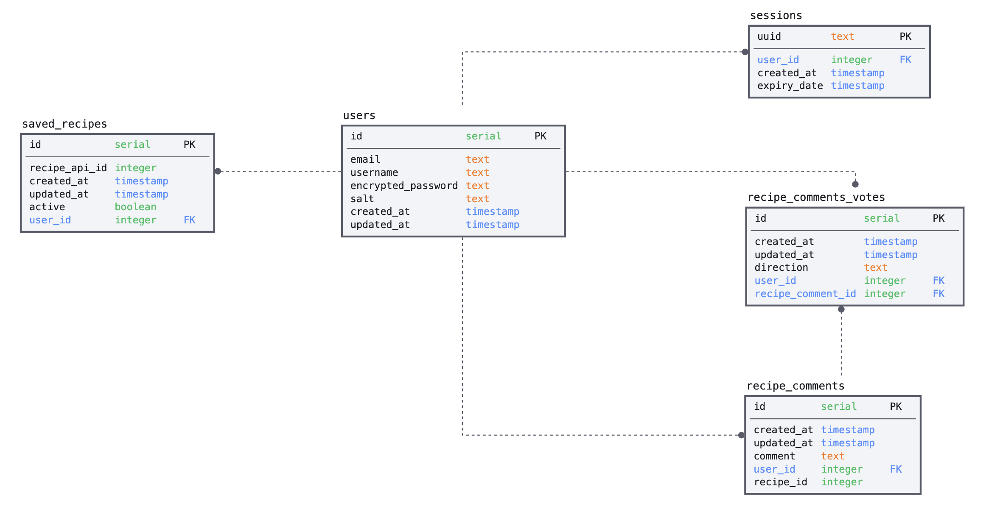

# Kitchen Genie 

Live version of [kitchen-genie](https://kitchen-genie.co.uk) is up and running!

For the final two weeks of Sigma Labs training, trainees were assigned to various group projects. The I chose to be assigned to was the Kitchen Genie ('recipe team' back then) project. Our team of four consisted of Tawab Rahmani, Keano Robinson, Rafiul Ansari and myself. 

Our goal for this project was to build a tool that home cooks can use to combat household food waste. Since​, by weight, UK households throw away 4.4 million tonnes of edible food each year; and 24% of people do not know what was in their fridge when they shop (Wrap Study - 2020). So it was clear to us that we wanted to build an application that helped people come up with recipes from the ingredients they already have at home. 

[Supercook](https://www.supercook.com/#/recipes) was also a main inspiration behind this project, however, we thought we could do so much better upon tear down. 

## 1.0 How does Kitchen Genie work?

#### 1.1 Page Diagram 

- HOME
    - SEARCH RESULTS
    |  -- RECIPE
    - FAVOURITES (Logged in experience)
    |  -- RECIPE 
    - ABOUT US
    |
    - FAQ

#### 1.2 Description 

The kitchen-genie website has both a logged in and logged out experience. In the logged in experience, users from the home page can insert ingredients into the search bar. When searched, Kitchen Genie will fetch data from the Spoonacular API and populate recipes on a Search results page. From here, the user (logged in) can favourite recipes by clicking the heart icon on recipe cards or can click a card to navigate to the recipe page. On the Recipe page, the application will fetch recipe data from the Spoonacular API and populate that information in an clean and consistent manner. The user can view recipe description, preparation and what ingredients they do/don't have (if coming from search results). Again, the user can favourite the recipe (if logged in) and can make comments on the recipe if logged in and only view them if logged out. Logged in users can navigate to the favourites page, where the user can view all favourited recipes. 

## 1.3 Key Features 

1. Login/Signup page.
2. Search bar: Allows users to insert the ingredients they have in a stylistic and legible format. Searches Spoonacular API by these ingredients.
3. Recipe results page: Displays all the recipes with relevant ingredients. 
4. Recipe page: From the recipe result page, users can click a recipe and the recipe ingredients are populated on the page in a consistent, appealing manner. 
5. Comments: If a user is logged in, the user has the ability to comment on recipes. 
6. Favourites: From recipe page, or results page, user can favourite recipe and it populates it on the users favourites page.
7. Random recipe generator: User can click a button to get a random recipe from the Spoonacular API. 

## 3.0 Software Design Choices

### 3.1 Third-party API

The team debated whether to build our own recipe table and populate it with our own data, which would have to be scrapped from the web. The problem being that to create a functional minimum viable product we would still have to generate thousands of recipes, which would have been a task in itself that would surpass the two week deadline of the project. Upon doing research, I found the Spoonacular API, a well crafted endpoint with a database of 320,000 recipes. Me and another team member convinced the team that this was the direction to go, as it would allow us to focus on the user experience of the website that has given Kitchen Genie it's high quality finish, whilst also creating a fully finished product that works. If the project had more time, we would definitely create our own api and db of recipes. 

### 3.2 Logged in user experience only 

The team also debated on creating a member only experience. The reason being for development simplicity. However, after deliberation, we decided to have a logged out experience as we thought it would be the best way to grow the app. Since users may not want to create an account when using the app for the first, this choice could bounce rate. Instead, we want them to see the clear benefit of kitchen genie on first use, then we hope users sign up on second use. 

### 3.3 Fetching data from the frontend. 

The team decided to fetch data from the Spoonacular API from the front end, due to simplicity and speed. However, we all agreed this was a bad choice as it meant we exposed our API key to the front end, and the speed gains were marginal if not inexistent. Making the fetches from the backend would address the security concern and help keep the backend functionality contained within the scope of the kitchen genie api. 

### 4.0 How we set up our database

My role was to set up the PostgreSQL database for everyone locally (as I was most experienced in this matter), helping team members setting up relevant .env.development/production files referencing database endpoints. The production version of the database was hosted on ElephantSQL.

## 5.0 Deployment 

I was responsible for helping deploy the front (Netlify) and backend (Heroku). Configuring CORS policy and routing the bought kitchen-genie.co.uk domain. 

One bug that I found on the production version of the site was that the session cookie was being deleted by 'window.location.replace(/)' when changing the page. To overcome this, I utilised the 'withRouter' module from the react-router library to allow the component to access the history object properties, where I could then redirect using 'this.props.history.push('/path'). 

The way I located this bug was utilising the network and application tools of the chrome inspector. This allowed me to check if there were any cors errors due to the cookie's properties and pinpoint when the cookie was being deleted. 

## 6.0 Current Bugs

Currently, the only bug that can be witnessed is that the session cookie does not save client side when the user closes the tab. Therefore the user logs out and has to re-enter details to log back in. This is only an issue with the production version of kitchen-genie.co.uk. Running the application locally servers no problem at all. 

## 7.0 Running Locally

### 7.1 Dependencies

1. Spoonacular API Key
2. PostgreSQL 

### 7.2 Installation

1. Clone the repository to your directory.
2. Within the backend and frontend directories, create a .env.development file
3. 

## 8.0 How we conducted our work.

Overall, the team adopted the Agile methodology, utilising kanban (Trello) to organise and assign tasks. Each day we would have a stand up in the morning talking about what each team member had completed the previous day, what we were going to do and what issues individuals were having. For difficult features the team would take part in pair programming, especially if features each team member were building were dependent on each other.  

During the day, we communicated on slack. 

### 8.1 Assigning Tasks 

At the start of the project, we began to hack out the key features for our project, categorizing them as 'must haves' and 'desirable' and then turning them into Trello tickets. Each ticket had a user story that covered target user, functionality, and goal; as well as the feature's passing criteria. These tickets were adamantly followed to help the team stay on track.

### 8.2 My specific roles within the team

1. Database Architecture and Setup. 
2. Generating the Recipe page.
3. Deployment 

## 9.0 Extra: What if we had more time?
1. Use client-side cookies to save the ingredients the user has during a session, so recipe ingredients can be compared even if the user has not come from the search results page. 

